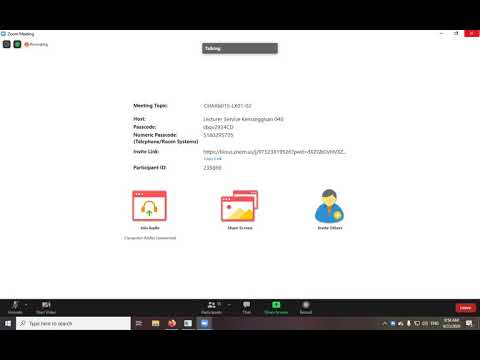

# BimayInstantVicon

Instantly open ongoing Video Conference.

Guide:  

## Releases

You can open the releases from [here](https://github.com/ayangd/BimayInstantVicon/releases).

## How to Use

If you are using the program for the first time, input your credential.

    Username: <Your bimay name, without @binus.ac.id>
    NIM: <Your NIM, for lab login>
    Password: <Your bimay password, won't be shown on screen upon typing>

Your credential will be saved at `%APPDATA%\BimayInstantVicon\cred.txt`.  
If the credential is not correct, the file will be automatically deleted.

The next time you open the program, it will automatically open the Video Conference link for you.  
If the class is a lab class, it will automatically login for you, if there's no captcha. Else, the login page will show up.

## Grabbed Resources

This program will grab information from BinusMaya MyClass.  
The link that will be opened is a class of the current date and time (50 minutes before start and 40 minutes after start).

## Build from Source

You would need a compiler with C++17 support (compiler release on 2017 or later).

### Windows

Compilation from Dev-C++ is not supported as it uses old MinGW compiler. It's better to use Microsoft Visual Studio 2017 or newer, by opening and building the solution.

### Linux/MacOS

Minimal GCC version should be GCC 5, as specified [here](https://gcc.gnu.org/projects/cxx-status.html#cxx17). You would also need libcurl and libcrypto++ library for compilation.

Installation of libcurl and libcrypto++ can be as this example, in Debian Linux distros (like Ubuntu and Mint)

    sudo apt install libcurl4-openssl-dev libcrypto++-dev

After everyting is satisfied, just run:

    make

And this will output `bimayinstv`. If you wish to run this anywhere, just put `bimayinstv` to `/usr/bin`.

## Suggesting/Bug Reporting

If you have suggestions or found a bug, kindly create an issue in this repository.